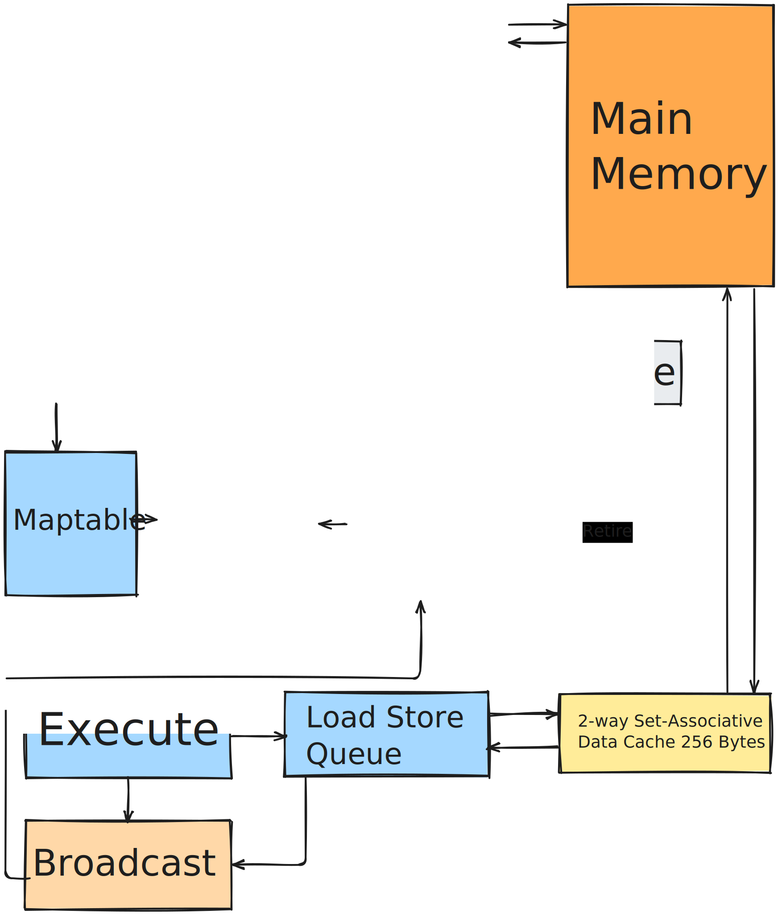
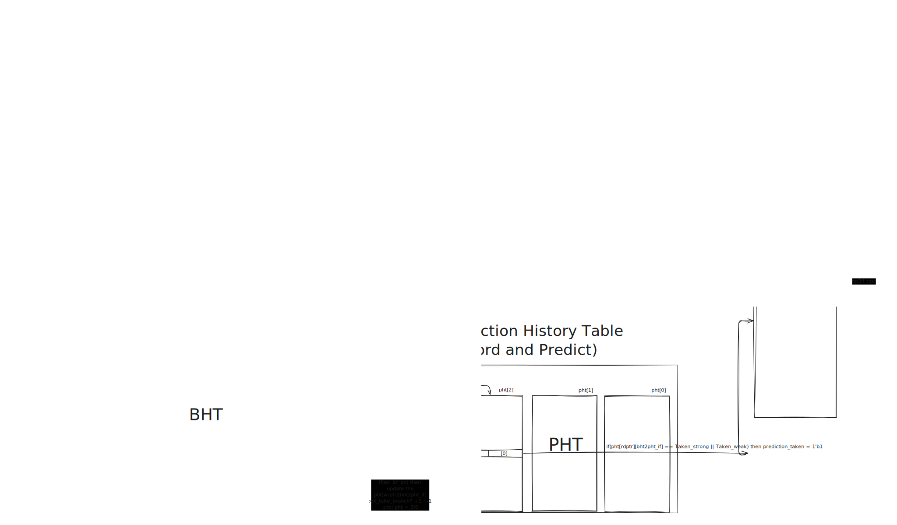
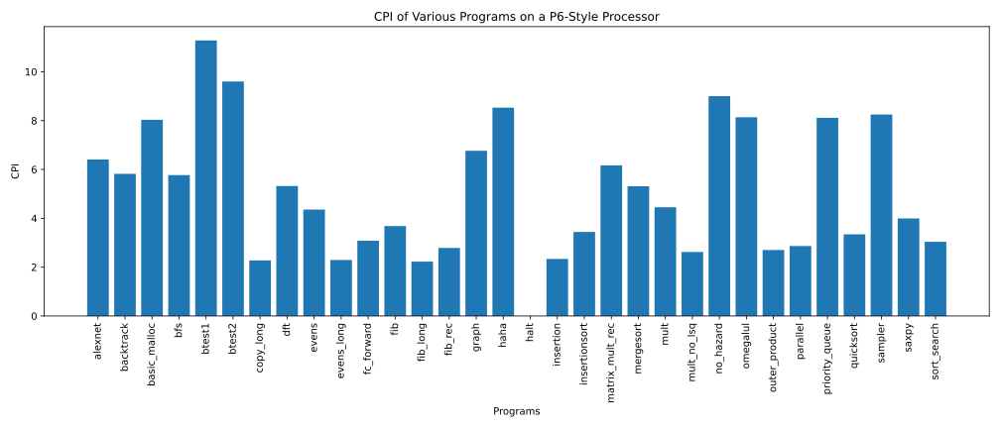
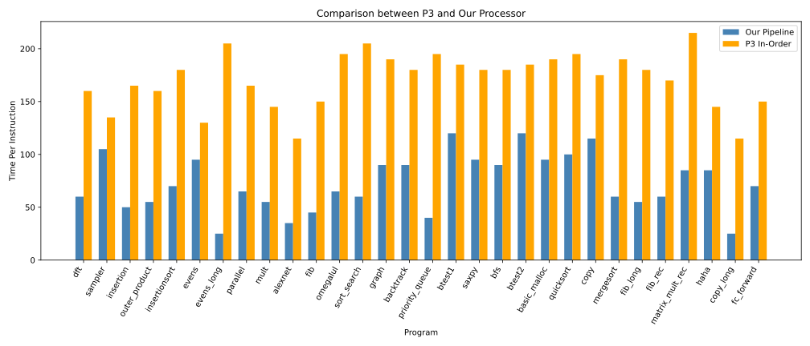
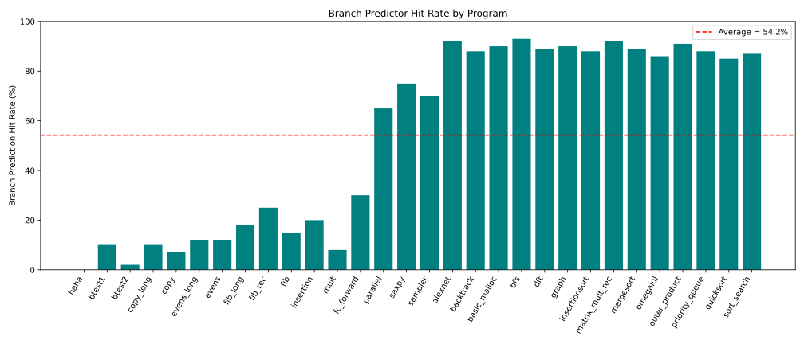
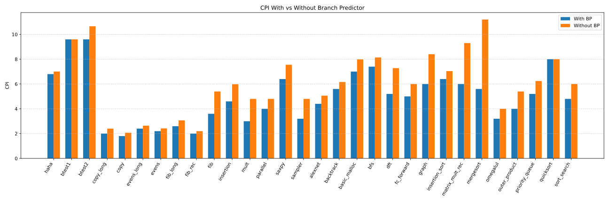

# CSEE4824 Final Project Report

Group7: Zhenning Yang, Jiajun Jiang, Haiyu Wei

## Introduction

In this project, we designed and implemented a high-performance out-of-order processor that significantly improves upon the baseline in-order pipeline developed in Project 3. Our design incorporates several advanced architectural components—including speculative instruction fetch, branch prediction, reservation stations, a reorder buffer (ROB), load-store queue (LSQ), and instruction cache and data cache to optimize instruction-level parallelism and overall throughput.

This report details the architectural design, implementation detail of the components, testing process and performance evaluation of our processor, explaining how each component works with each other.

## Design

Our pipeline design adopts a modern out-of-order execution architecture that balances performance and complexity. Instruction fetch is handled by a 2-way set-associative instruction cache (256 Bytes). Fetched instructions are temporarily held in a 16-entry instruction buffer, which enables decoupling between the fetch and dispatch stages. The dispatch unit interfaces with a register file and distributes instructions to three key components: the register maptable for register renaming, the reservation station for operand readiness tracking, and the reorder buffer (ROB) for maintaining in-order retirement. Once issued, instructions are executed in the functional units or routed through the Load Store Queue (LSQ) for memory operations. The LSQ is backed by a 2-way set-associative data cache (also 256 Bytes) to handle memory latency efficiently. Results are broadcasted to update dependent instructions and commit results through the ROB. Overall, this design enables high instruction-level parallelism while ensuring correctness through precise exception handling and register state recovery.

## Implementation

### Fetch

Our instruction fetching mechanism utilizes a proactive fetch and buffer strategy implemented through `fetch.sv` and `inst_buffer.sv`. The next instruction address (`NPC_reg`) is calculated using branch prediction results (`bp2if_pc`) from the branch predictor, enabling early fetching from the instruction cache. This address is then immediately used to issue a cache request (`IF_Icache_packet.Icache_addr_in`). Upon receiving valid data from the instruction cache, fetched instructions, along with their corresponding PC and next-PC values, are forwarded into the instruction buffer. 

#### Instruction Buffer

The instruction buffer, implemented as a circular FIFO queue, continuously stores these fetched instructions, using `w_ptr` (write pointer) and `r_ptr` (read pointer) to manage entries and their order. On a pipeline flush due to mispredicted branches (`squash` signal), the buffer resets pointers, discarding instructions and preparing to receive correct instructions from the updated branch target (`branch_target`), in order to minimize pipeline downtime and ensuring a smooth recovery.

### Branch Prediction

Our processor implements branch prediction within `fetch.sv`. The branch predictor receives the current fetch address `if_pc` and utilizes past branch results and target addresses to predict the next instruction address `bp2if_pc`. This predicted address is immediately assigned as the next PC `NPC_reg` to the instruction fetch stage. 

If a branch misprediction occurs (`Branch_Miss` asserted), the fetch logic updates the fetch program counter (`PC_reg`) to the correct branch target (`branch_target`), swiftly correcting the instruction flow. At the same time, a squash signal is passed to the instruction buffer, which immediately flushes instructions and resets internal pointers (`w_ptr` and `r_ptr`) to ensure the processor resumes fetching instructions from the corrected execution path. 

#### Branch Target Buffer

Our BTB stores the predicted target addresses (`predict_pc_out`) associated with branch instructions, indexed by the current instruction address (`if_pc`). When fetching, the BTB quickly checks if there's a known branch target (`hit` signal); if a hit occurs, the predicted target address is immediately used to update the fetch stage’s next PC (`bp2if_pc`). This allows the processor to fetch instructions from anticipated targets early, reducing pipeline stalls.

#### Branch Prediction Table	

The Branch Prediction Table in our design, implemented within the `Branch_Predictor`, tracks historical branch outcomes to predict whether branches are likely to be taken. This prediction (`predict_taken`) guides the next instruction fetch address choice. Correct predictions significantly reduce control hazards by preparing instructions ahead of actual branch resolution.

#### Branch History Table

Our BHT is encapsulated within branch predictor module, it maintains branch execution histories (taken or not-taken outcomes). Each entry corresponds to a specific branch PC and memorizes its recent behavior. When the processor resolves a branch, it updates the corresponding history entry, improving future prediction accuracy. For misprediction case `Branch_Miss`, BHT updates help the predictor adapt rapidly, enhancing prediction reliability.

### Cache

#### Icache

Our 2-way set-associative instruction cache stores 64-bit cache lines (`icache_data`) indexed by the requested address (`proc2Icache_addr`). Each cache line entry includes a `valid` bit and a `tags` field to verify correctness. When a fetch request arrives, the cache extracts the `current_tag` and `current_index` and checks if there is a hit by comparing the stored tag and the valid bit (`Icache_valid_out`). 

If there is a hit, the cache outputs either the lower or upper 32 bits of the cache line (`Icache_data_out`), depending on address offset (`offset = proc2Icache_addr[2]`). If miss, the cache sends a `BUS_LOAD` memory request (`proc2Imem_command`) and waits for a memory response (`Imem2proc_data`) tagged by `Imem2proc_tag`. 

The response is matched with `current_mem_tag` to ensure correct fillin. After filling, the cache line's data and tag are updated and the `valid` bit is set. To handle branch mispredictions (`Branch_Miss`), the cache resets pending requests (`current_mem_tag` cleared), ensuring correct instruction stream recovery without stale data.

#### Dcache

Our 2-way set-associative data cache is implemented as a two-way set-associative cache to store and retrieve data efficiently during memory operations. It is structured with multiple sets, each containing two lines (`line[0]` and `line[1]`) and managed by `current_addr_index` and `current_addr_tag` extracted from the requested address. 

When a load or store request from the LSQ (`dcache_in`) arrives, the dcache checks for a hit on both line by comparing tags and valid bits. If there is a hit, the cache supplies data for a load or updates data for a store (`dcache2lsq_packet.completed`). If miss, it determines which line to evict based on the `last_accessed` bit (LRU-like policy) and issues a `BUS_LOAD` command (`proc2Dmem_cmd`) to fetch the cache line from memory. If evicting dirty data, it first writes back the evicted line with a `BUS_STORE`. 

After a memory response matches the expected `waiting_mem_tag`, the cache updates the appropriate line with the new data (`Dmem2proc_data`). Store operations are handled by updating partial bytes, half-words, or full words (`mem_size` and `current_addr_offset`) directly into the cache. Branch mispredictions are also properly managed to avoid stale loads or stores by coordinating with external squash signals.

### Reorder Buffer (ROB)

Our ROB is implemented as an array `ROB_content` saves and removes instructions based on the movement of head/tail pointer. It stores data such as the destination register, PC/NPC, execution result (`value`, `alu_result`), and control bits (`cp_bit` for completion, `ep_bit` for branch outcome). New instructions are allocated at `tail`, and when results arrive from the CDB (`CDB_packet_in`) or LSQ (`lsq_input`), entries are updated. 

Commit happens when `ROB_content[head]` is marked complete (`cp_bit==1`), advancing the head pointer. If a branch misprediction is detected (`Branch_Miss`), the ROB selectively resets entries after the branch.. Our ROB also sends operand readiness and values (`rob_rs_packet`) to the reservation stations during instruction dispatch, enabling dynamic scheduling.

### Reservation Station

Our reservation station is implemented with two separate arrays: `RS_Alu` for arithmetic operations and `RS_Mem` for memory operations, both are made up of multiple reservation station entries (`ResSta` and `ResSta_MEM`). When an instruction arrives, it will occupy a free RS entry selected by a priority encoder (`priority_encoder` or `priority_encoder_mem`). 

Each RS entry determines whether its source operands are ready (`ready`) or pending using corresponding ROB tags (`RS1_Tag`, `RS2_Tag`). If operands are not ready, RS listens to bus for broadcasts (`cdb_packet`) to capture results. Once all operands are ready (`ready[0] && ready[1]`), the instruction is marked as ready for issue. 

Another priority encoder (`u_priority_encoder_rs`) selects the instruction to issue to the execution units, maximizing resource utilization. Flushes are also supported: if a mispredicted branch is detected (`take_branch`), reservation stations will clear instructions to recover quickly.

### Load-Store Queue

Our LSQ entries (`lsq`) track memory instructions using `head` and `tail` pointers. When dispatch is happening, new load/store instructions will be inserted, recording fields such as PC, destination register, and memory address/data placeholders. 

As addresses and data become available from the execution stage (`ex_lsq_packet`), LSQ updates the corresponding entries. Loads send read requests to the DCache when their data is ready, while stores wait until commit to write. 

Responses from the dcache are interpreted according to the memory size and sign-extension rules before being forwarded onto the CDB (`lsq2cdb`). Additionally, if branch misprediction happens, the LSQ is reset to discard invalid memory operations, ensuring precise memory state recovery.

## Testing
The Testing is based on VCS+Verdi Simulation. And for the output files, we will get an log file in diff file directory. This will show the difference of writeback values of golden reference and our design. If you want to show the results, you could do the following makefile commands:

make simulate_all
make all_diff

## Evaluation

#### A. Performance Metrics

The iron law:

$$
\text{Processor Performance} = \frac{\#\text{Instructions}}{\text{Program}} \times \frac{\#\text{Cycles}}{\text{Instruction}} \times \frac{\text{Time}}{\#\text{Cycles}}
$$

#### B. Overall Performance

We calculated Time Per Instruction of all test cases for our pipeline and the in-order pipeline of project 3. Here we assume the clock period of the in-order pipeline of project 3, which is the latency of the memory access. The real latency of the in-order pipeline should be the latency of the memory access plus the critical path of the pipeline itself.x
$$
\text{Time/Instruction} = \frac{\#\text{Cycles}}{\text{Instruction}} \times \frac{\text{Time}}{\text{Cycle}} 
= \text{CPI} \times \text{Period}
$$
It can be seen from Figure 4 that the Time Per Instruction of all programs are decreased significantly in our pipeline, indicating that our pipeline has a much faster instruction processing speed.

#### C. Branch Predictor 

The hit rate of our branch predictor varies across programs. Programs with predictable control flow achieves high branch prediction hit rates, often exceeding 90%. These workloads benefit from loops or structured branching that the local history predictor can learn effectively. In contrast, control-intensive or irregular programs like `btest1`, `btest2`, are exhibit extremely low hit rates (below 10%). The average hit rate across all workloads is approximately 54.2%. Overall, the predictor performs well on regular control-flow workloads but struggles with those featuring rapidly changing or hard-to-learn branch patterns.

The improvement of branch prediction on overall pipeline performance is shown in the CPI comparison across workloads. As shown in Fig. 7, programs with irregular control flow—such as `btest1`, `btest2`, and `matrix_mult_rec`—experience significant CPI reduction when the branch predictor is enabled. For example, `btest2` shows a CPI drop from over 5.5 to around 4.7, despite its intentionally misleading branches. This improvement highlights the predictor's ability to recover some control flow efficiency even in adversarial conditions. In contrast, programs with minimal branching or straight-line code, such as `copy` or `evens_long`, show little to no change in CPI, as branch mispredictions are rare to begin with. Interestingly, some benchmarks like `parallel` and `insertion` demonstrate moderate CPI improvement, implying moderately predictable branching. Overall, enabling branch prediction yields consistent CPI reductions across most workloads, validating the effectiveness of our dynamic branch prediction strategy in accelerating instruction throughput.

